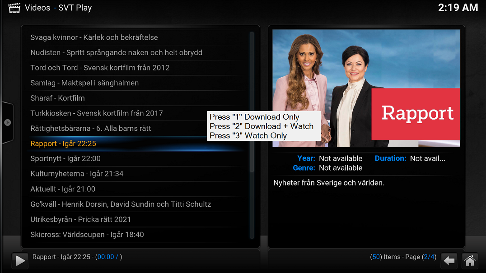

# FFmpeg Recorder

I got bored testing different addons in regard to downloading videos, as none of them seems to work the way i want.

so i decided to make use of ffmpeg configured as an external player.

By doing that it will be avaliable for all addons that has playable links, and the download for most part goes on in the background, so i can continue to use kodi while it is ongoing.

You can even start multiple downloads at the same time if you wish, depending on what source you use.

Added option is now that you can watch while you are downloading, this is especially useful on livestreams.

This is done thru a "pipe", so no extra bandwith is being consumed.

So here's how i do it:

Download ffmpeg from here: https://ffmpeg.org/download.html

It's a zip archive, so no installation required, just extract ffmpeg.exe & ffplay.exe to a location of your choice.

They both have to be in the same folder.

For this purpose i have made a custom program to simplify, called FFMPEG_Recorder.exe that you can find a link to at the bottom.

Download it and put in the same folder as ffmpeg.exe,
or some other permanent location from where it will work as a "dummy player" before running it.

Now start FFMPEG_Recorder.exe, and point to the location of ffmpeg.exe, 
after that you will be prompted for a download location for the videos.

After execution, 2 xml files will be created in the same folder as FFMPEG_Recorder.exe, 
that is playercorefactory.xml & playercorefactory2.xml.

Copy those to the %APPDATA%\Kodi\userdata\ folder.

On the desktop a shortcut will be created called "FFMPEG_Recorder Default Change" that 
toggles between the 2 xml files, making FFMPEG_Recorder.exe default player.

This is necessary, as **some addons don't respect the "Play using.." context menu** 
and will revert to the default player, and others wont display a context menu at all.

Press "Q" to stop an ongoing recording/download.

Default container format is mp4, but you can change it by editing the Options 

section in ffmpeg.ini to any of the formats supported by ffmpeg, and there are plenty.

In the Options section you can also edit the timestamp switch to off, 
if you don't like it in the view window.

Recorded video don't have a timestamp.

Delete ffmpeg.ini to restart setup.

Created in Autohotkey

_Update 2020-12-17 **v1.5**_
 - _"Watch Only" option added_
 - _Added parsing of rtmp links to ffmpeg_
  - _Added parsing of cookies_
 - _ffmpeg command editable in ffmpeg.ini_
 - _Improved detection of Kodi install location_

If you have installed it before, simply overwrite the old exe with the new one and delete ffmpeg.ini to restart setup.

Download here: https://github.com/dobbelina/Playground/releases/download/v1.5-Windows/FFMPEG_Recorder-v1.5.zip

## Screenshot

 

---

# Auto-Resume Livestreams In Kodi

So what does it do?

It checks the colour on 2 different coordinates every 2 seconds on the screen.

As soon as a video or stream cuts of or ends it hits p, (Play) resuming whatever you are watching,

as the colour of your 2 skin coordinates will match.

When executed the first time the user can input what command to send to kodi,(p = play)

and an appropriate shortcut key to toggle the function on and off.

After that you get prompted to click twice on 2 different coordinates in the

skin, when the player is idle.

Preferably in an area that is consistent among the different addons.

When setup is finished you hear 2 short beeps.

All settings get saved in the file 2-Coordinates.ini that gets created in the same folder as the exe.

To re-run the setup, simply delete the ini file.

Confluence skin recommended.

Created in Autohotkey

Download here: https://github.com/dobbelina/Playground/releases/download/v1.0-Windows/Replay.zip

